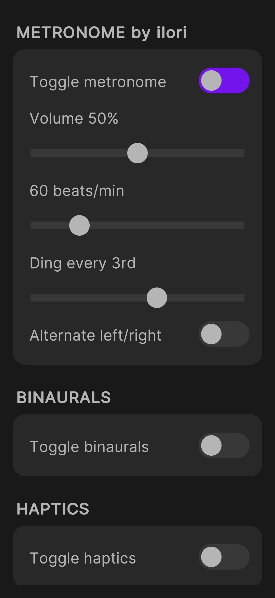
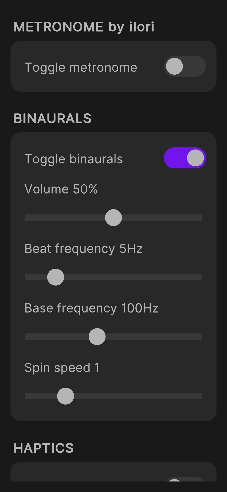
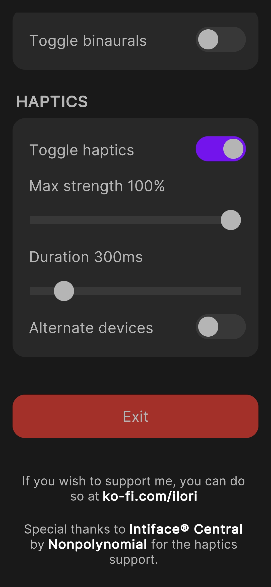

# Metronome by ilori
This project is a Metronome/Binaurals app with haptics support. The app uses [Intiface Central](https://buttplug.io/)'s unity package to connect to Intiface Central, in order to sync the haptics to toys. Likewise you will need the Intiface Central to play the haptics on your device.

> This app is a work in progress that I develop on my limited free-time. So if you like using it, and would like to donate towards its further development, or would just otherwise want to absolutely make my day <3  
> You can buy me a [ko-fi](https://ko-fi.com/ilori) or sponsor me here at [github](https://github.com/sponsors/ilor1). Not expected, but immensely appreciated!

## Features

### Metronome

### Binaurals

### Haptics support

